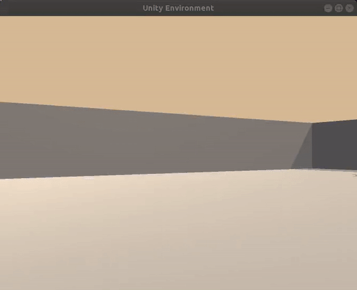

[//]: # (Image References)

[image1]: trained_agent.gif "Trained Agent"

# Project 1: Navigation

### Introduction

For this project, you will train an agent to navigate (and collect bananas!) in a large, square world.  



A reward of +1 is provided for collecting a yellow banana, and a reward of -1 is provided for collecting a blue banana.  Thus, the goal of your agent is to collect as many yellow bananas as possible while avoiding blue bananas.  

The state space has 37 dimensions and contains the agent's velocity, along with ray-based perception of objects around agent's forward direction.  Given this information, the agent has to learn how to best select actions.  Four discrete actions are available, corresponding to:
- **`0`** - move forward.
- **`1`** - move backward.
- **`2`** - turn left.
- **`3`** - turn right.

The task is episodic, and in order to solve the environment, your agent must get an average score of +13 over 100 consecutive episodes.

# Install

1. Create and activate python environment
```
  conda env create -f environment.yml
  conda activate bananaenv
```

2. Download environment as described in section `Udacity Instructions`

  Note that for Linux version there is a handy script `download.sh`

# Training and testing

1. Training the Agent

  ```
    python -m train_agent
  ```

  This command will produce the checkpoint.pth file.

2. Testing the Agent

  ```
    python -m test_agent
  ```

3. Running the same commands in jupyter notebook and implementation details
  - run jupyter `jupyter notebook`
  - open `Report.ipynb`

# Learning from pixels

1. Training the Agent

  ```
    python -m pixels.train_agent
  ```

  This command will produce the pixels/pixels_checkpoint.pth file.

```
  'Academy' started successfully!
  Unity Academy name: Academy
          Number of Brains: 1
          Number of External Brains : 1
          Lesson number : 0
          Reset Parameters :

  Unity brain name: BananaBrain
          Number of Visual Observations (per agent): 1
          Vector Observation space type: continuous
          Vector Observation space size (per agent): 0
          Number of stacked Vector Observation: 1
          Vector Action space type: discrete
          Vector Action space size (per agent): 4
          Vector Action descriptions: , , ,
  device: cuda
  Episode 100	Average Score: 0.162
  Episode 200	Average Score: 1.18
  Episode 300	Average Score: 2.84
  Episode 400	Average Score: 5.73
  Episode 500	Average Score: 8.65
  Episode 600	Average Score: 10.55
  Episode 700	Average Score: 11.88
  Episode 800	Average Score: 11.67
  Episode 900	Average Score: 12.50
  Episode 990	Average Score: 13.01
  Environment solved in 890 episodes!	Average Score: 13.01
```

2. Testing the Agent

  ```
    python -m pixels.test_agent
  ```

3. Sicne the training takes considerable time, it is handy to train from command line.
  The notebook report contains only information about testing and implementation details.
  - run jupyter `jupyter notebook`
  - open `pixels/Report.ipynb`


## Udacity Instructions

### Default setup

1. Download the environment from one of the links below.  You need only select the environment that matches your operating system:
    - Linux: [click here](https://s3-us-west-1.amazonaws.com/udacity-drlnd/P1/Banana/Banana_Linux.zip)
    - Mac OSX: [click here](https://s3-us-west-1.amazonaws.com/udacity-drlnd/P1/Banana/Banana.app.zip)
    - Windows (32-bit): [click here](https://s3-us-west-1.amazonaws.com/udacity-drlnd/P1/Banana/Banana_Windows_x86.zip)
    - Windows (64-bit): [click here](https://s3-us-west-1.amazonaws.com/udacity-drlnd/P1/Banana/Banana_Windows_x86_64.zip)

    (_For Windows users_) Check out [this link](https://support.microsoft.com/en-us/help/827218/how-to-determine-whether-a-computer-is-running-a-32-bit-version-or-64) if you need help with determining if your computer is running a 32-bit version or 64-bit version of the Windows operating system.

    (_For AWS_) If you'd like to train the agent on AWS (and have not [enabled a virtual screen](https://github.com/Unity-Technologies/ml-agents/blob/master/docs/Training-on-Amazon-Web-Service.md)), then please use [this link](https://s3-us-west-1.amazonaws.com/udacity-drlnd/P1/Banana/Banana_Linux_NoVis.zip) to obtain the environment.

2. Place the file in the `novis_network/` folder, and unzip (or decompress) the file.

### Visual network setup

1. Download the environment from one of the links below.  You need only select the environment that matches your operating system:
    - Linux: [click here](https://s3-us-west-1.amazonaws.com/udacity-drlnd/P1/Banana/VisualBanana_Linux.zip)
    - Mac OSX: [click here](https://s3-us-west-1.amazonaws.com/udacity-drlnd/P1/Banana/VisualBanana.app.zip)
    - Windows (32-bit): [click here](https://s3-us-west-1.amazonaws.com/udacity-drlnd/P1/Banana/VisualBanana_Windows_x86.zip)
    - Windows (64-bit): [click here](https://s3-us-west-1.amazonaws.com/udacity-drlnd/P1/Banana/VisualBanana_Windows_x86_64.zip)

    (_For Windows users_) Check out [this link](https://support.microsoft.com/en-us/help/827218/how-to-determine-whether-a-computer-is-running-a-32-bit-version-or-64) if you need help with determining if your computer is running a 32-bit version or 64-bit version of the Windows operating system.

    (_For AWS_) If you'd like to train the agent on AWS (and have not [enabled a virtual screen](https://github.com/Unity-Technologies/ml-agents/blob/master/docs/Training-on-Amazon-Web-Service.md)), then please use [this link](https://s3-us-west-1.amazonaws.com/udacity-drlnd/P1/Banana/Banana_Linux_NoVis.zip) to obtain the environment.

2. Place the file in the `vis_network/` folder, and unzip (or decompress) the file.

### Instructions

Follow the instructions in `Navigation.ipynb` to get started with training your own agent!  

### (Optional) Challenge: Learning from Pixels

After you have successfully completed the project, if you're looking for an additional challenge, you have come to the right place!  In the project, your agent learned from information such as its velocity, along with ray-based perception of objects around its forward direction.  A more challenging task would be to learn directly from pixels!

To solve this harder task, you'll need to download a new Unity environment.  This environment is almost identical to the project environment, where the only difference is that the state is an 84 x 84 RGB image, corresponding to the agent's first-person view.  (**Note**: Udacity students should not submit a project with this new environment.)

You need only select the environment that matches your operating system:
- Linux: [click here](https://s3-us-west-1.amazonaws.com/udacity-drlnd/P1/Banana/VisualBanana_Linux.zip)
- Mac OSX: [click here](https://s3-us-west-1.amazonaws.com/udacity-drlnd/P1/Banana/VisualBanana.app.zip)
- Windows (32-bit): [click here](https://s3-us-west-1.amazonaws.com/udacity-drlnd/P1/Banana/VisualBanana_Windows_x86.zip)
- Windows (64-bit): [click here](https://s3-us-west-1.amazonaws.com/udacity-drlnd/P1/Banana/VisualBanana_Windows_x86_64.zip)

Then, place the file in the `p1_navigation/` folder in the DRLND GitHub repository, and unzip (or decompress) the file.  Next, open `Navigation_Pixels.ipynb` and follow the instructions to learn how to use the Python API to control the agent.

(_For AWS_) If you'd like to train the agent on AWS, you must follow the instructions to [set up X Server](https://github.com/Unity-Technologies/ml-agents/blob/master/docs/Training-on-Amazon-Web-Service.md), and then download the environment for the **Linux** operating system above.
